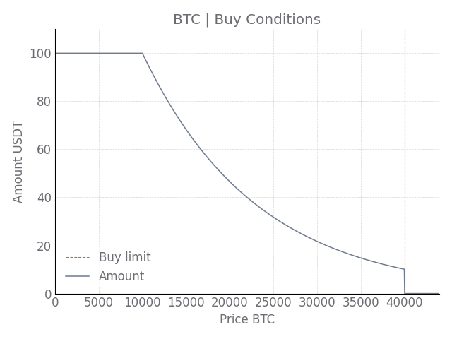

_DCA-bot_ is a Python-based program for making recurring and automatic cryptocurrency purchases. 
Being developed using the [ccxt](https://github.com/ccxt/ccxt) library it can work on almost every exchange (although, it has only been tested on Binance and FTX) and on every crypto/crypto or crypto/fiat pair available on the chosen exchange. It was designed to run on 24/7 servers that are as light as a Raspberry Pi. 

The bot can operate in three DCA modalities:
 - **Classic**: buy a fixed dollar amount regardless of price conditions
 - **BuyBelow**: buy only if the price is below a price level
 - **VariableAmount**: map a price range onto an amount range, so that when the price goes down the amount of dollars invested increases


### What is DCA?
Dollar-Cost-Averaging (DCA) is a popular investing strategy in which a fixed dollar amount of a desired asset is bought at regular time intervals, regardless of market conditions.  It is particularly suitable for markets with high volatility such as cryptocurrency markets.
While DCA might not provide the best possible returns, it has the added benefit of making you sleep well at night, even during bear market periods.

### Why use this bot?
Almost every exchange has the possibility of doing DCA (sometimes referred to as _recurrent buy_). So, why should you use this bot? Well, there are a few caveats you should consider when using the exchanges' recurring buy services. First, exchanges usually charge extra fees for recurrent buys. For example, the auto-invest service of Binance charges you double the regular fee. Second, the spread is sometimes higher than that of a normal market order. This means you can end up with a price that you cannot even trace back to the chart. Third, exchanges do not notify you with the outcome of the transaction or with a summary of your investment plan.    

The bot was developed to overcome the above limitations. In particular, the bot
 - makes recurrent purchases through market orders. Thus, fees are limited to the commission that exchanges charge for market orders. In the case of Binance, the market fees are 0.1%, and they can be further reduced by holding small amounts of their token (i.e., BNB) 
 - notifies you of every single transaction
 - notifies you of a summary of your investment plan 
 - reminds you to top up your account in case the balance is not enough for the next purchase. 

In addition, the bot introduces two non-standard DCA variants that are not usually available on recurring buy services:
 - *BuyBelow*: buy only if the price is below a price level
 - *VariableAmount*: map a price range onto an amount range, so that when the price goes down the amount of dollars invested increases.

## Getting started

### Requirements
You will need a server that can run continuously (i.e., 24/7). Due to its extreme low power consumption, a Raspberry Pi is an ideal candidate for the job.
You will need **python 3.8** and the following packages:
- ccxt
- numpy
- pandas
- matplotlib
- pyyaml

If you opted for a Raspberry Pi, you might find useful to follow this [installation tutorial](https://gist.github.com/CodingCryptoTrading/005fc6dc23e1d6012ac5ad74e2e55851).

### Set the API key
After choosing one of the [ccxt](https://github.com/ccxt/ccxt) supported exchanges, you will have to generate an API key with "reading" and "trading" permissions. For instance, the binance procedure is described [here](https://www.binance.com/en/support/faq/360002502072).

Then, input the generated key and secret in [auth/API_keys_example.yml](auth/API_keys_example.yml) and save it as `auth.yml`. Maintain the syntax as in the example file. In particular, after the name of the exchange be sure to specify if it is a *REAL* or *TEST* account (more on test accounts [here](#running-the-bot-in-test-mode)) 

Some exchanges (e.g., *coinbasepro*) may require an additional API parameter, sometimes called passphrase or password. If that is the case, put it under the voice *PASSPHRASE*. 

### Configure the bot
The bot settings are stored in [config/config_example.yml](config/config_example.yml). Make a copy of the file and rename it as  `config.yml`. Fill the file with your own settings.

Under _COINS_ put all the currencies that you wish to buy. Here is an example that will purchase 25 USDT of BTC every day at 19:30:
```
COINS:     # Choose the coins to buy:
    BTC:
        PAIRING: USDT         # Choose the currency to use to buy the coin
        AMOUNT: 25            # Quantity to buy in your pairing currency
        CYCLE: 'daily'        # Recurring Cycle can be: 'daily', 'weekly', 'bi-weekly', 'monthly'
        ON_WEEKDAY: 6         # [only for weekly and bi-weekly] Repeats on 0-6 (0=Monday...6=Sunday)
        ON_DAY: 1             # [only for monthly]. Date of the month [1-28]
        AT_TIME: '19:30'      # Format: 0 <= hour <= 23, 0 <= minute <= 59
```
Note that `ON_WEEKDAY` and `ON_DAY` are not considered in a daily `cycle`. There is also a "minutely" cycle (buy every minute) but is disabled with real accounts, it is only available in test mode for debugging purposes (see [Running the bot in test mode](#running-the-bot-in-test-mode)). 

Next, you have to specify what exchange to use, and whether it is a test account (`TEST: True`) or a real account (`TEST: False`):

```
### Exchange section ###
EXCHANGE: 'binance'
TEST: True
```
The exchange name has to match the labelling in the [ccxt](https://github.com/ccxt/ccxt) library (e.g., if you are in the US, you should replace `binance` with `binanceus`)

Finally, if you want to receive notifications (e.g., purchase reports, warnings, errors and others) fill the last section in the config file:
```
### Notification section ###
SEND_NOTIFICATIONS: True

# email sender info
EMAIL_ADDRESS_FROM: 'sender@email.com'
EMAIL_PASSWORD: 'sender email password'
SMTP_SERVER: 'smtp.mail.yahoo.com' # sender email SMTP server 

# email recipient
EMAIL_ADDRESS_TO: 'recipient@email.com'
```
The recipient address and the sender address can be the same. However, it is not wise to store the password of your main email on a server. Therefore, we suggest that you create an ad hoc email for this purpose. Gmail has too many restrictions, so it's not recommended. Yahoo mail is a good alternative (yahoo will ask you to define an "application" password, so you will not really enter the email password).

### Configure the bot (DCA variants)
The above configuration file describes the classic DCA approach. Here we describe two additional variants: BuyBelow and VariableAmount.

#### BuyBelow
BuyBelow is just like the classic DCA, but it doesn't buy when the price is above a given threshold. To use this modality, simply add the variable `BUYBELOW` in the config file as shown here:
```
COINS:     # Choose the coins to buy:
    BTC:
        PAIRING: USDT         # Choose the currency to use to buy the coin
        AMOUNT: 25            # Quantity to buy in your pairing currency
        CYCLE: 'daily'        # Recurring Cycle can be: 'daily', 'weekly', 'bi-weekly', 'monthly'
        AT_TIME: '19:30'      # Format: 0 <= hour <= 23, 0 <= minute <= 59
        BUYBELOW: 40000       # Don't buy above this price.
```
In the example, the bot will not buy BTC if the price is above 40000 USDT.

#### VariableAmount
In VariableAmount a price range is mapped onto an amount range, with an exponential or linear function. Prices outside the range will either result in no purchase (above the upper price range) or saturate the dollar amount (below the lower price range). To clarify this modality, take a look at the below chart that illustrates how many USDT are invested depending on the BTC price. In the example, the price range [10000-40000] USDT is mapped exponentially onto the amount range [10-100] USDT. When the price is above 40000 USDT, the bot doesn't buy (as in *BuyBelow* modality). As the price decreases, the bot uses an increasing amount of USDT, until the price reaches the lower price range and the amount of USDT saturates.



To use the VariableAmount modality the `AMOUNT` in the config file has to be modified as follows:

```
COINS:     # Choose the coins to buy:
    BTC:
        PAIRING: USDT                   # Choose the currency to use to buy the coin
        AMOUNT:                         # Now AMOUNT is a dictionary
            RANGE: [10.1,100]           # Range of quantity to buy in your pairing currency
            PRICE_RANGE: [10000,40000]  # Range of prices
            MAPPING: 'exponential'      # Mapping function: 'exponential' or 'linear'
        CYCLE: 'daily'                  # Recurring Cycle can be: 'daily', 'weekly', 'bi-weekly', 'monthly'
        AT_TIME: '19:30'                # Format: 0 <= hour <= 23, 0 <= minute <= 59
```
Once the bot starts, a buy-conditions chart, similar to the above, will be saved in the trades folder. We suggest playing a bit with `RANGE`/`PRICE_RANGE`/`MAPPING` and inspecting the chart until you get a buy-condition curve that satisfies your needs.

### Run the bot
Now that everything has been set up, we are ready to run the bot. Just navigate to the folder where you stored the bot and run:
```
python3.8 dca_bot.py
```
The bot is able to recover from where it left in case it is interrupted, the system crashes or is rebooted abruptly. Therefore, we recommend running the bot automatically every time the server starts. If you are running the bot on a linux server, such as in the case of a Raspberry Pi, you can do so by defining a cronjob. Simply run:
```
crontab -e
```
And add the following line:
```
@reboot cd /path/where/theBootIsStored && python3.8 dca_bot.py &
```
To check that everything is working, try restarting the server. Once rebooted you should be notified that the bot has just started. Now you can enjoy recurring purchases at minimal cost and without any effort!

## Check the bot
If you have activated the notification system, you will receive all the relevant information by mail, including buy outcomes, investment summaries, general info, warnings and errors.

Even if you have disabled notifications, you can still get all the information by accessing the  `trades` folder that will be created once the bot is started. An example  of a `trades` folder is available in [trades_example](trades_example/). Inside you will find:

- `log.txt` : records everything is happening with the bot
- `graph_COIN.png` : chart of all the purchases of a given COIN
- `graph_COIN_buy_conditions.png` : buy-condition chart (only in *VariableAmount* mode)
- `orders.json` : json file containing every filled order exactly as returned by the exchange
- `orders.csv` : a more readable version of the above (with only the most essential information)
- `stats.csv` : summary statistics of your investment plans
- `next_purchases.csv` : a list of the next purchases


If at any time you wish to create a new accumulation plan from scratch (not considering previous purchases), you can do so by deleting the `trades` folder and restarting the bot.


## Running the bot in test mode

If a sendbox is available in the chosen exchange, the bot can operate in testing mode (e.g., binance offers this service). Thus, you can use the test mode in case you want to try the bot with fake money first. The test mode can also be helpful for debugging purposes.

To set the bot to run in test mode, set `TEST: True` in your `config/config.yml` file. Then, you need to generate a test account on the exchange, get the API key and secret and put them in your `auth/API_keys.yml` file under `TEST` (i.e., follow the syntax as in [auth/API_keys_example.yml](auth/API_keys_example.yml)). 

Getting a test account in Binance is straightforward. Just log in [the binance testnet](https://testnet.binance.vision/) with a GitHub account and then click on generate API keys.

## Contributing
Any contribution to the bot is welcomed. If you have a suggestion or find a bug, please create an [issue](https://github.com/CodingCryptoTrading/dca-crypto-bot/issues).

## Disclaimer
 The investment in cryptocurrency can lead to loss of money over short or even long periods. Use DCA-bot at your own risk. 
